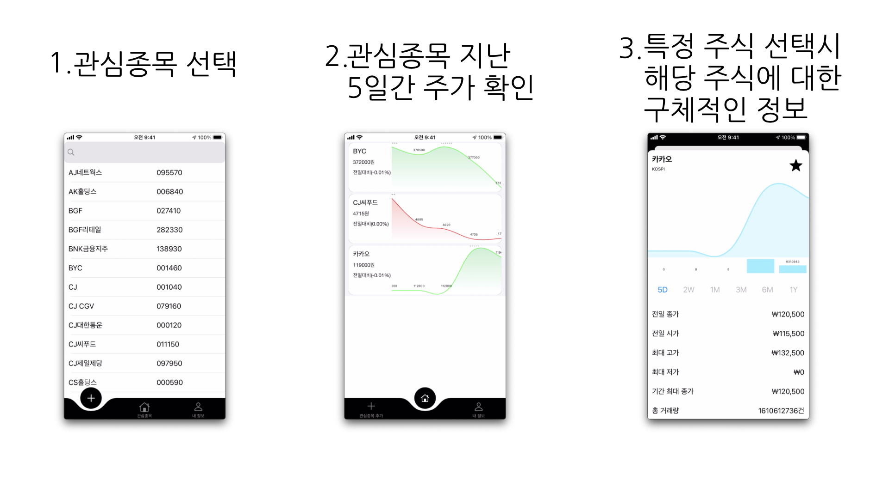

## PROJECT 소개

---

증권사 앱은 음봉 양봉을 모두 표현하는 CandleStick 차트를 주로 사용 중입니다. 외국 주식 관련 앱을 조사하고, 주변 지인들의 조언으로 CandleStick 차트가 아닌 아이폰 기본 주식 앱에서 제공하는 것과 같이 종가 기반의 주식 차트를 제공하기 위한 차트 앱 구현했습니다.

다만 실시간 주식 데이터를 받아오는 것과 증권사 계좌연동은 현실적인 어려움이 있어서 관심 종목에 대해서 차트를 제공하는 것외에는 미완성 상태입니다. 그래서 python의 pandas-datareader를 사용해 중계 서버를 구현해 앱에서 필요한 데이터는 중계 서버에서 받아온 데이터를 다시 중계 서버에서 그리는 것으로 대체했습니다.

**작업기간** : 2020.12.16 ~ 2021.02.06, 프로젝트 진행 중단

**투입인원** : 1명

**주요업무** 

- 기획 및 디자인
- 중계 서버 구현
- 앱 구현

**프로젝트를 하면서 배운점**

- python 중계 서버 구현

    [주식 차트 앱 중계 서버](https://www.notion.so/9c78505f25c847f4b6e56615e834d2b0)

- python 중계 서버의 데이터 전달

    [python의 Dataframe을 swift에 전달하는 방법](https://www.notion.so/python-Dataframe-swift-e8f9bfb0d464408db314baab07f4d320)

- Charts 라이브러리 사용방법

[danielgindi/Charts](https://github.com/danielgindi/Charts)

**스킬 및 사용툴**

`xcode` `git` `CoreData` `Charts` `Firebase` `python` `flask` `pandas-datareader` `aws`

### 깃허브 링크

---

- 주식 차트 앱 깃허브 링크

[papayetoo/swiftStock](https://github.com/papayetoo/swiftStock)

- 주식 차트 앱 중계 서버 링크

[papayetoo/swiftStock_Server](https://github.com/papayetoo/swiftStock_Server)
